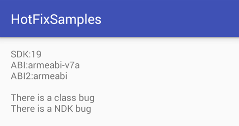
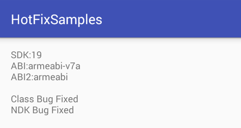

 

# HTHotFix

基于multidex思路的代码热更新框架，支持gradle 1.5以上的构建工具，支持2.3以上的android版本。

## 编译流程    

1.编译过程中生成原始apk中的类摘要信息

2.补丁包编译时通过比较摘要信息获取已更新文件

## 特点
相较于nuwa之类的同思路的开源框架：

+ 简化编译流程，减少人工干预的流程
+ 基于tranform api，提高插件兼容性
+ 增加补丁包的签名验证，避免补丁包被恶意hook
+ 支持ART模式下补丁包生成。ART模式下，需要将需要引用到补丁类的所有其他类打入补丁包中

## 使用方式

### 补丁包生成

#### 1.在主工程build.gradle中添加依赖
		
	apply plugin: "com.netease.hearttouch.hthotfix"
	buildscript {
	    repositories {
	    	jcenter()
	    }
	    dependencies {
	        classpath 'com.netease.hearttouch:ht-hotfix-gradle:0.0.2'
	    }
	}
	dependencies {
		compile 'com.netease.hearttouch:ht-hotfix:0.0.2' 
	}

#### 2.编译原始APK，并生成原始apk中的类摘要信息，同时保存mapping混淆文件

使用原始的`assemble${variant}`命令生成原始APK，此时在工程根目录/hthotfix/intermediates/文件夹下生成classes.hash、so.hash和maping.txt三个文件。

* classes.hash：原始版本的类摘要文件
* so.hash：原始版本so库摘要文件
* mapping.txt：类混淆文件，只有在开启了混淆的编译才会生成

#### 3.生成补丁文件

在build.gradle添加以下配置：

	hthotfix{
	    generatePatch true
	    includePackage=["xxx.xxx.xx","yyy.yyy.yyy"]
	    excludeClass =["xxx.xxx.xx.X"]	
	}
	
* includePackage：需要生成补丁包的包名
* excludeClass：在includePackage剔除部分类，支持通过`@HotfixIgnore`注解剔除相关类

使用`gradle generate${variant}Patch`命令生成补丁包，例如release编译可以使用
`gradle generateReleasePatch`生成补丁包。

此时在hthotfix目录生成unsigned_patch.apk即为补丁包。

#### 4.签名

补丁包支持android签名机制，可以通过在hthotfix添加以下配置生成签名机制：

	hthotfix{
	    generatePatch false
	    storeFile file('xxx')
	    storePassword "xxx"
	    keyAlias "xxx"
	    keyPassword "xxx"
	    includePackage=["xxx.xxx.xxx","yyy.yyy.yyy"]
	    excludeClass =["xxx.xxx.xxx.YY"]
	}
	

此时在hthotfix目录生成的patch.apk为签名之后的补丁包。

#### 5.混淆

在混淆文件添加

	-keep class com.netease.hearttouch.hthotfix.** { *; }
	-dontwarn xxx.xxx.xxx.**   //可能需要更新的包

避免混淆热更新sdk，以及将需要更新的代码逻辑剔除混淆警告。

#### 6.支持关联引用的补丁制作模式

ART模式下，若需修复的类修改了类变量或方法，可能会导致出现内存地址错乱的问题。需要待修复的类的父类，以及调用了这个类的所有类都加入这个补丁包中。通过开启可生成该模式下的全补丁包。

	hthotfix{
	    scanRef true
	    generatePatch false
	    storeFile file('xxx')
	    storePassword "xxx"
	    keyAlias "xxx"
	    keyPassword "xxx"
	    includePackage=["xxx.xxx.xxx","yyy.yyy.yyy"]
	    excludeClass =["xxx.xxx.xxx.YY"]
	}

暂不支持以下情况的类调用：

* 类常量字段
* 匿名类
* 异常

#### 7.so文件更新

hthotfix下存在配置soPatch，默认值为true，可将更新的so文件打入补丁包：

	hthotfix{
	    generatePatch true
	    includePackage=["xxx.xxx.xx","yyy.yyy.yyy"]
	    excludeClass =["xxx.xxx.xx.X"]
	    soPatch true	
	}

通过遍历build.gradle文件中sourceSets所配置的的JniLibs文件夹，以及NDK开发所生成的文件夹`/app/build/intermediates/ndk/${flavorName}/${buildTypeName}/lib/`，默认将armeabi下so文件打入补丁包，也可通过添加配置`onlyARM false`
生成不同CPU架构的补丁包。

若主包中已将arm64-v8a的so文件打入，则当补丁包只有armeabi时会出现异常以致崩溃。可以通过对主包拆分，让工程只生成armeabi的包。

	splits {
        abi {
            enable true //enables the ABIs split mechanism
            reset() //reset the list of ABIs to be included to an empty string (this allows, in conjunctions with include, to indicate which one to use rather than which ones to ignore)
            include 'armeabi' //indicate which ABIs to be included
            universalApk false //indicates whether to package a universal version (with all ABIs) or not. Default is false

        }
    }

#### 8.补丁包文件结构

	patch.apk
	├── META-INF
	│   ├── HEARTOUC.RSA
	│   ├── HEARTOUC.SF
	│   └── MANIFEST.MF
	├── classes.dex
	└── libs
	    └── libHotfixSampleJniLib.so

### 补丁包使用

#### 1.添加java代码

在入口application添加

		public class HFApplication extends Application{
		
		    @Override
		    protected void attachBaseContext(Context base) {
		        super.attachBaseContext(base);
		        HotFix.install(this);//初始化
		    try{
		        HotFix.loadPatch(this, Environment.getExternalStorageDirectory().getAbsolutePath().concat("/patch.apk"), false);//加载补丁包		
		    }catch (PatchSignVerifyFailedException e){
		        e.printStackTrace();
		        Log.e("hotfix","sign is not right");
		    }
	}
	
loadPatch函数通过bCheckPatchSign是否开启补丁包的签名验证，当开启签名校验，只有补丁包和主apk的签名一致时，才会加载成功。当loadPatch返回false，加载不成功

    public static boolean loadPatch(Context context, String dexPath,boolean bCheckPatchSign) throws  PatchSignVerifyFailedException 

#### 2.添加权限
在AndroidManifest添加sd读写权限

    <uses-permission android:name="android.permission.READ_EXTERNAL_STORAGE"/>
    <uses-permission android:name="android.permission.WRITE_EXTERNAL_STORAGE"/>
    
如果你的app支持Android6.0的Runtime Permission（targetSdkVersion 23以上），请保证 HotFix.loadPatch()加载补丁包之前sd卡读写权限已授权，否则会导致加载失败。

*注：用户如果使用本示例代码测试，请使用targetSdkVersion 22或以下，因为application启动时候还未出现activity，进而导致android6.0以上版本加载补丁包失败*

## 示例工程使用  

将根目录的patch.apk放置在sd卡根目录，运行app。

原始的执行逻辑为显示“There is a XXX bug”，如图：

更新成功后将显示“XXX Bug Fixed”，如图：

* Class Bug Fixed：dex更新成功
* NDK Bug Fixed：so文件更新成功

## License

The MIT License (MIT)

Copyright (c) 2016 Netease Inc.

Permission is hereby granted, free of charge, to any person obtaining a copy
of this software and associated documentation files (the "Software"), to deal
in the Software without restriction, including without limitation the rights
to use, copy, modify, merge, publish, distribute, sublicense, and/or sell
copies of the Software, and to permit persons to whom the Software is
furnished to do so, subject to the following conditions:

The above copyright notice and this permission notice shall be included in all
copies or substantial portions of the Software.

THE SOFTWARE IS PROVIDED "AS IS", WITHOUT WARRANTY OF ANY KIND, EXPRESS OR
IMPLIED, INCLUDING BUT NOT LIMITED TO THE WARRANTIES OF MERCHANTABILITY,
FITNESS FOR A PARTICULAR PURPOSE AND NONINFRINGEMENT. IN NO EVENT SHALL THE
AUTHORS OR COPYRIGHT HOLDERS BE LIABLE FOR ANY CLAIM, DAMAGES OR OTHER
LIABILITY, WHETHER IN AN ACTION OF CONTRACT, TORT OR OTHERWISE, ARISING FROM,
OUT OF OR IN CONNECTION WITH THE SOFTWARE OR THE USE OR OTHER DEALINGS IN THE
SOFTWARE.